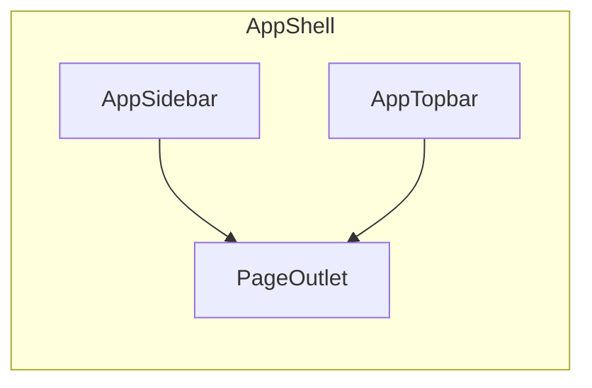

# IAPI — Esqueleto do Dashboard

## Objetivo

Projeto greenfield em [`/home/navi/Desktop/IAPI`](/home/navi/Desktop/IAPI) com **apenas o shell da aplicação** e uma **home = Dashboard** com dados mockados. Sem landing, sem login, sem backend. As demais rotas do produto (INPI, processos, financeiro, etc.) ficam como placeholders mínimos na navegação.

Contexto de domínio vem de [`.ref/`](.ref/) (IAPI / Nome Que Marca), mas **não** reutilizamos a paleta navy/bronze/papel do HTML de referência.

## Stack

- Vite + React 19 + TypeScript
- Tailwind CSS v4
- shadcn/ui (Radix + CVA)
- React Router
- Lucide React (ícones)

## Direção visual

Minimalista, artístico, elegância levemente feminina — sem o look “SaaS genérico” (evitar roxo/indigo, cream + terracotta, dark mode forçado).

- **Fundo:** off-white quente com textura sutil (gradiente radial + grain leve via CSS)
- **Tipografia:** display serif expressiva (ex.: *Fraunces* ou *Cormorant Garamond*) + sans humanista (ex.: *Manrope* ou *Outfit*) via Google Fonts
- **Acento:** rosa-poeira / blush suave (`oklch` / HSL custom) em CTAs e estados ativos — contraste alto no texto
- **Espaço:** muito whitespace, tipografia generosa no título da página, bordas finas, quase sem cards; onde houver “card”, usar apenas superfície sutil para KPIs interativos/legíveis
- **Motion:** 2–3 animações discretas (collapse da sidebar, fade-in do conteúdo, hover nos nav items)

Tokens em CSS variables no theme do shadcn (`--background`, `--foreground`, `--primary`, `--sidebar`, etc.).

## Estrutura da app

```
src/
  components/
    layout/
      AppShell.tsx      # sidebar + topbar + outlet
      AppSidebar.tsx    # colapsável (ícone ↔ ícone+label)
      AppTopbar.tsx     # busca, notificações, avatar mock
    ui/                 # componentes shadcn
  pages/
    DashboardPage.tsx   # home
    PlaceholderPage.tsx # rotas futuras
  data/
    mock.ts             # KPIs e listagens do dashboard
  App.tsx
  main.tsx
  index.css
```

## Shell



- **Sidebar colapsável:** grupos espelhando a visão do produto (Visão geral, Inteligência INPI, Meus processos, Relacionamento, Gestão), mas só **Dashboard** é real; demais itens navegam para `PlaceholderPage` com o nome da seção.
- Estado collapsed persistido em `localStorage`.
- **Topbar:** breadcrumb/título da rota, campo de busca (UI only), indicador de prazos críticos (mock), avatar/usuário mock.
- Layout: `min-h-screen`, conteúdo com padding generoso; home em `/`.

## Dashboard (home)

Composição única, não “dashboard genérico lotado”:

1. Saudação + data (copy em PT-BR, tom editorial)
2. Faixa de 3–4 KPIs (processos ativos, prazos críticos, tarefas do dia, receita do mês) — dados de [`src/data/mock.ts`](src/data/mock.ts)
3. Duas colunas leves: **próximos prazos** + **tarefas prioritárias** (listas, sem kanban ainda)
4. Mini pipeline de processos (barra ou steps: Depósito → … → Registro) só como visual de status

Sem analytics charts nesta fase.

## Fora de escopo (agora)

- Landing, login, auth
- Integração INPI / API / backend
- Telas completas de tarefas, financeiro, busca, clientes
- Dark mode, temas alternativos

## Setup

1. `npm create vite@latest . -- --template react-ts` (na raiz do repo, preservando `.ref/`)
2. Tailwind + path aliases `@/`
3. Inicializar shadcn e adicionar só o necessário: `button`, `input`, `avatar`, `badge`, `separator`, `tooltip`, `scroll-area`, `sheet` (mobile sidebar se couber)
4. React Router com layout route + rotas filhas
5. README curto com `npm install` / `npm run dev`

## Critério de pronto

- `npm run dev` abre direto no dashboard
- Sidebar colapsa/expande com labels
- Topbar presente
- Visual alinhado à direção artística descrita
- Demais itens do menu levam a placeholders sem quebrar o shell
