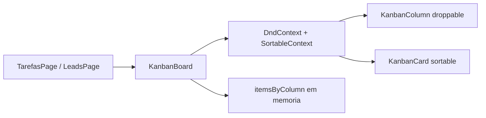

# Kanban funcional em memória (Tarefas e Leads)

## Comportamento

- Arrastar cards **entre colunas** e **reordenar dentro da coluna**
- Estado só em memória (`useState`): volta ao mock ao recarregar a página
- Contadores/meta atualizam ao vivo (Tarefas: quantidade; Leads: soma dos valores da coluna)
- Visual: opacidade no card arrastado + destaque leve na coluna de destino

## Abordagem técnica

Adicionar **`@dnd-kit/core`** + **`@dnd-kit/sortable`** + **`@dnd-kit/utilities`** (padrão React, acessível, bom em desktop/touch).

Extrair um board genérico para não duplicar lógica entre as duas páginas:

### Novos arquivos

- [`src/components/kanban/KanbanBoard.tsx`](src/components/kanban/KanbanBoard.tsx) — `DndContext`, handlers `onDragEnd`/`onDragOver`, colunas + cards sortable
- [`src/hooks/use-kanban-state.ts`](src/hooks/use-kanban-state.ts) — estado `Record<columnId, Item[]>` + `moveItem(activeId, overColumnId, overIndex)`
- Estender [`src/components/KanbanColumn.tsx`](src/components/KanbanColumn.tsx) / card com props de droppable/sortable (ou wrappers em `kanban/`)

### Dados

- **Tarefas**: inicializar de [`tarefasLista`](src/data/processos.ts) agrupado por `status` (`A fazer` → `Concluída`)
- **Leads**: achatar [`leadColumns`](src/data/relacionamento.ts) em itens com `columnId`; ao mover, recalcular `meta` da coluna somando valores parseados (`R$ 8.500` → número → formatado de volta como `R$ XXk` ou valor completo)

Helper pequeno em `src/lib/money.ts` para parse/format dos valores dos leads.

### Páginas

- [`src/pages/TarefasPage.tsx`](src/pages/TarefasPage.tsx) — trocar grid estático por `KanbanBoard` + render de card de tarefa
- [`src/pages/LeadsPage.tsx`](src/pages/LeadsPage.tsx) — idem com cards de lead e scroll horizontal mantido

Manter o visual atual dos cards (badge, avatar, empresa, etc.); só a interação muda.

## Fora de escopo

- Persistência (localStorage/API)
- Criar/editar/excluir cards pelos botões “Nova tarefa/lead” (continuam decorativos)
- Undo/histórico

## Validação

- `npm install` das deps + `npm run build` / `npm run lint`
- Smoke: arrastar tarefa entre colunas; reordenar; arrastar lead e ver meta da coluna mudar
