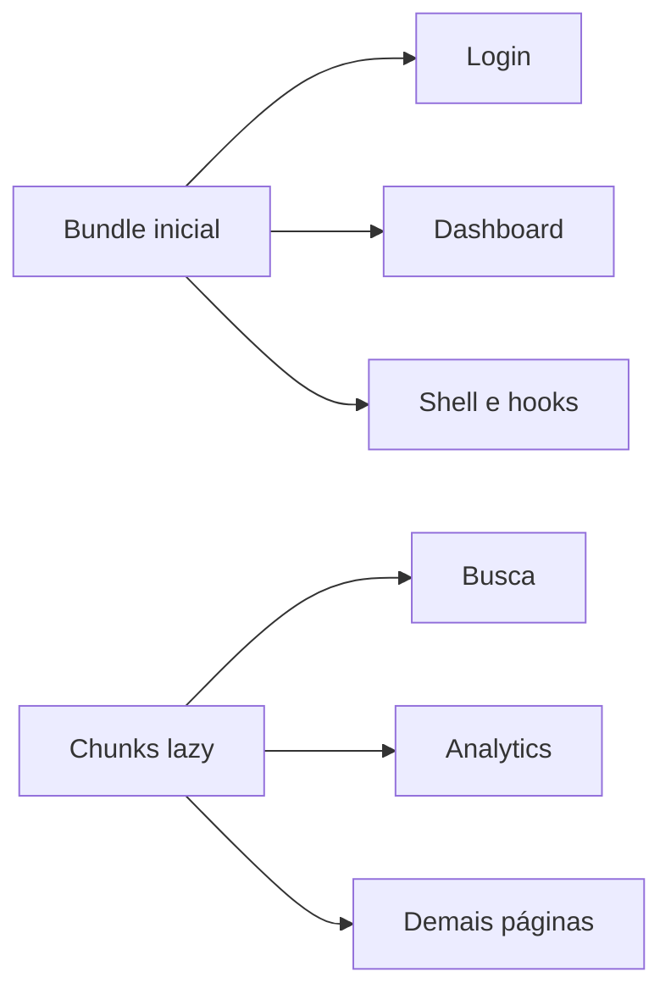

# Refatoração e desempenho

## Objetivo

Melhorar manutenibilidade e tempo de carregamento inicial, mantendo o visual e o comportamento atuais. Escopo focado nos maiores ganhos; sem redesenhar páginas.

## 1. Desempenho — rotas lazy

Em [`src/App.tsx`](src/App.tsx), todas as 14 páginas entram no bundle inicial.

- Manter **eager**: `LoginPage` e `DashboardPage`
- Carregar o restante com `React.lazy` + `Suspense` (fallback leve no `Outlet` de [`AppShell`](src/components/layout/AppShell.tsx))
- Vite fará code-split automático; dados de [`inpi.ts`](src/data/inpi.ts) / [`gestao.ts`](src/data/gestao.ts) etc. só sobem com a rota correspondente

## 2. Extrair componentes compartilhados

Criar em `src/components/`:

| Componente | Substitui |
|---|---|
| `PageHeader` | Bloco eyebrow + título + descrição ± CTA (~14 páginas) |
| `FilterChips` | Botões `default`/`outline` de filtro (Casos, Clientes, Analytics, Monitoramento, Busca) |
| `KpiStrip` | Grade de KPIs com `border-b` (Dashboard, Prazos, Financeiro, Monitoramento) |
| `KanbanColumn` | Casca de coluna usada em Tarefas e Leads |

Helpers em `src/lib/`:

- `status-badge.ts` — um mapa `tone → Badge variant` + adapters para status em PT (`Ativo`, `Pago`, `Alta`, etc.), removendo mappers locais em Casos, Busca, Clientes, Usuarios, Financeiro, Tarefas, Dashboard
- `initials.ts` — unificar `initials()` duplicado em [`relacionamento.ts`](src/data/relacionamento.ts) e [`gestao.ts`](src/data/gestao.ts)

## 3. Quebrar páginas grandes

**[`BuscaPage.tsx`](src/pages/BuscaPage.tsx) (~427 linhas)**

- Extrair `BuscaForm` (formulário + chips/toggles)
- Extrair `BuscaResults` (tabela desktop + lista mobile)
- Mover `Chip`/`Toggle` locais para os compartilhados (ou `components/ui` se fizer sentido)

**[`AnalyticsPage.tsx`](src/pages/AnalyticsPage.tsx) (~279 linhas)**

- Mover `buildLineGeometry` / `buildDonutGradient` para `src/lib/charts.ts`
- Remover `useMemo` desnecessário sobre dados estáticos de módulo
- Fazer o filtro de período (`range`) alterar um subset mock dos dados (hoje os chips não mudam nada) **ou** removê-los se forem só decorativos — decisão: **ligar a um subset estático por período** (mês/trimestre/ano) para o controle ter efeito real sem API

## 4. Limpeza e higiene

- Remover [`src/pages/PlaceholderPage.tsx`](src/pages/PlaceholderPage.tsx) (não referenciado)
- Remover `useMemo` triviais em Casos/Clientes/Monitoramento onde o array mock é minúsculo (filtro síncrono basta)
- Em [`AgendaPage`](src/pages/AgendaPage.tsx): keys estáveis nos eventos (`id` no mock, não `ev.label`)
- Em [`TarefasPage`](src/pages/TarefasPage.tsx): pré-agrupar por status uma vez em vez de `filter` por coluna

## 5. O que não fazer nesta rodada

- Não extrair um “ResponsiveDataTable” genérico demais (colunas diferem muito; risco de abstração ruim)
- Não reestruturar todos os arquivos de `data/` (só initials + uso com lazy)
- Não mudar auth, tema, nem design system além do necessário para os extratos

## Ordem de execução

1. Lazy routes + Suspense
2. `PageHeader`, `FilterChips`, `status-badge`, `KpiStrip`, `KanbanColumn`, `initials`
3. Aplicar nos consumidores (páginas)
4. Split Busca + Analytics helpers
5. Remover PlaceholderPage e higiene (useMemo, keys, groupBy)

## Validação

- `npm run build` e `npm run lint`
- Smoke: login → dashboard → 2–3 rotas lazy (busca, financeiro, leads) + logout
